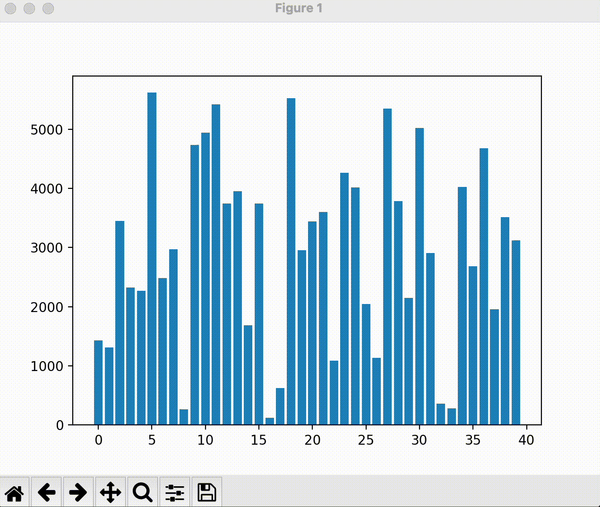

# Visualization for different sorting algorithms

## Demonstration
---

### Bubble Sort


### Selection Sort


### Merge Sort

## Prerequisite
---

Install python version 3 on the device and run the following command to install the required packages.
```
pip install -r requirements.txt
```

## Run Arguments
---

The script uses `argparse` to take the following arguments:

### `--low`

- **Description**: The lower bound for the range of numbers to be sorted.
- **Default**: `0`
- **Type**: `int`

### `--high`

- **Description**: The upper bound for the range of numbers to be sorted.
- **Default**: `20`
- **Type**: `int`

### `--size`

- **Description**: The number of elements in the array to be sorted.
- **Default**: `20`
- **Type**: `int`

### `--seed`

- **Description**: The seed for the random number generator to ensure reproducible results.
- **Default**: `1`
- **Type**: `int`

### `--delay`

- **Description**: The delay in seconds between each visualization update.
- **Default**: `0.1`
- **Type**: `float`

## Example Usage

To run the script with custom parameters, use the following command:

```bash
python <filename>.py --low 10 --high 50 --size 30 --seed 42 --delay 0.2
```